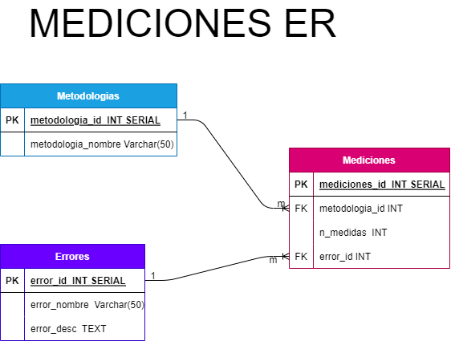

# Mediciones API

## Metodologias **(EC)**

- metodologia_id INT SERIAL AUTOINCREMENT **(PK)**
- metodologia_nombre VARCHAR(50)

## errores **(ED)**

- error_id INT SERIAL AUTOINCREMENT **(PK)**
- error_nombre Varchar(50)
- error_desc TEXT

## Mediciones **(EC/EP)**

- mediciones_id INT SERIAL **(PK)**
- metodologia_id INT
- n_medidas INT
- error_id INT

## Relaciones

- Una metodologia puede pertenecer a muchos mediciones**(1 a N)**
- Una error puede pertenecer a uno o muchas mediciones**(1 a 1)**

## Operaciones

- Una metodologia puede ser creada
- Una metodologia puede ser leida

- Un error puede ser creada
- Un error puede ser leida
- Un error puede ser eliminado
- Un error puede ser actualizado

- Una medicion puede almacenar datos
- Una medicion puede ser leido
- Una medicion puede ser accedido mediante el nombre
- Una medicion puede ser eliminado

## Img

